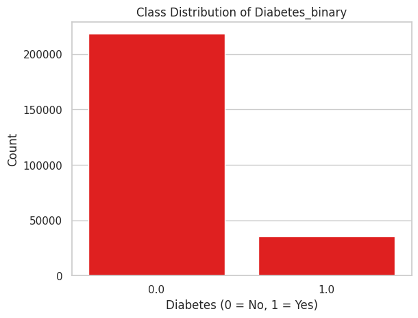
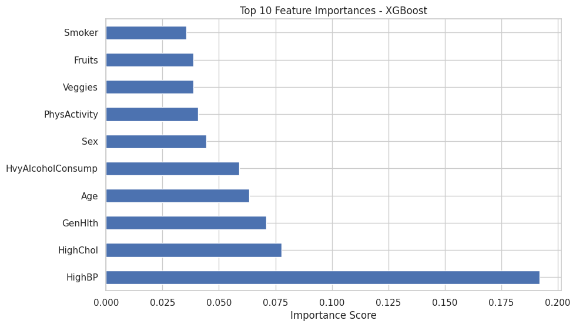
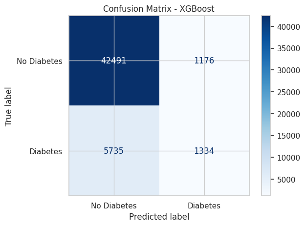

# 🩺 Diabetes Prediction (Imbalanced Binary Classification)

- **Dataset**: `diabetes_binary_health_indicators_BRFSS2015.csv`
- **Target**: Binary — `0` (No Diabetes), `1` (Diabetes)
- **Challenge**: Highly imbalanced dataset (~85% No Diabetes)

---

## 🔍 Project Overview

- Performed EDA and identified key patterns using class distribution and correlation
- Addressed class imbalance using SMOTE
- Trained and evaluated Logistic Regression, Random Forest, and XGBoost
- Final model selected: **XGBoost**

---

## 📊 Key Visuals

### 🎯 Class Distribution

### 🌟 Feature Importance (XGBoost)

### 🧩 Confusion Matrix (XGBoost)

---

## ✅ Best Model
- **XGBoost** achieved the highest accuracy and F1-score
- Performed best at detecting the minority (diabetic) class

---

## 💡 Key Insights
- Important predictors: Age, BMI, General Health, High Blood Pressure
- SMOTE significantly improved recall for diabetic cases

---
