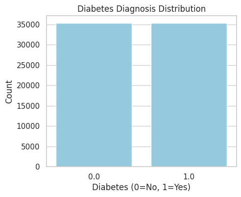
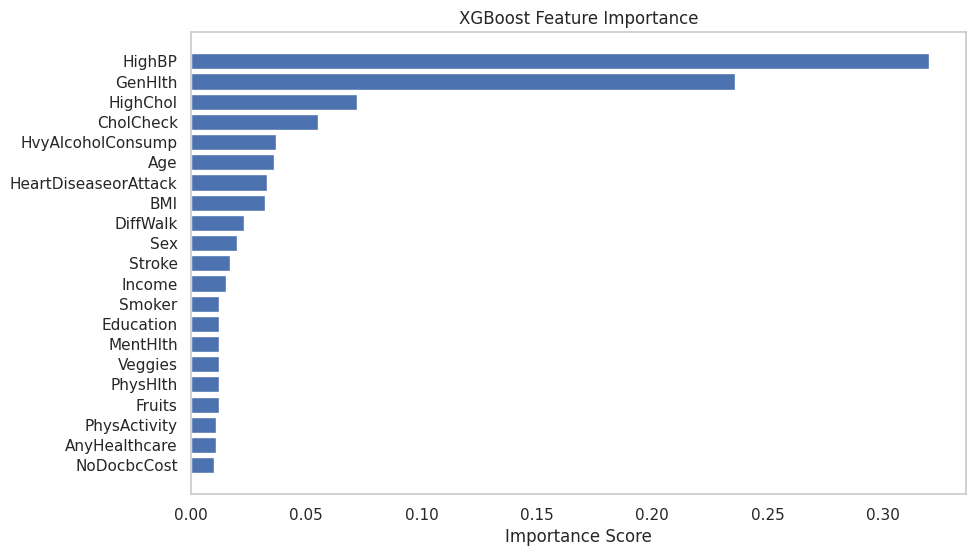
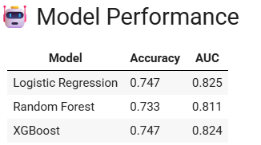

# 🩺 Diabetes Prediction (Balanced 50/50 Dataset)

- **Dataset**: `diabetes_binary_5050split_health_indicators_BRFSS2015.csv`
- **Target**: Binary — `0` (No Diabetes), `1` (Diabetes)
- **Advantage**: Perfectly balanced classes — no need for oversampling

---

## 🔍 Project Overview

- Cleaned and explored dataset
- Performed feature importance analysis
- Trained Logistic Regression, Random Forest, and XGBoost
- Compared model performance with the imbalanced version

---

## 📊 Key Visuals

### 🎯 Balanced Class Distribution

### 🌟 Feature Importance (XGBoost)

### 📈 Model Performance Comparison

---

## ✅ Best Model
- **XGBoost** showed the best balance of precision and recall
- Logistic Regression performed significantly better here compared to imbalanced data

---

## 💡 Key Insights
- Top predictors: HighBP, HighChol, GenHlth

---
