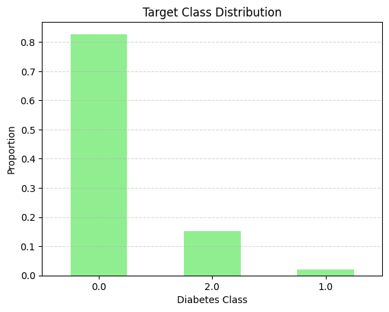
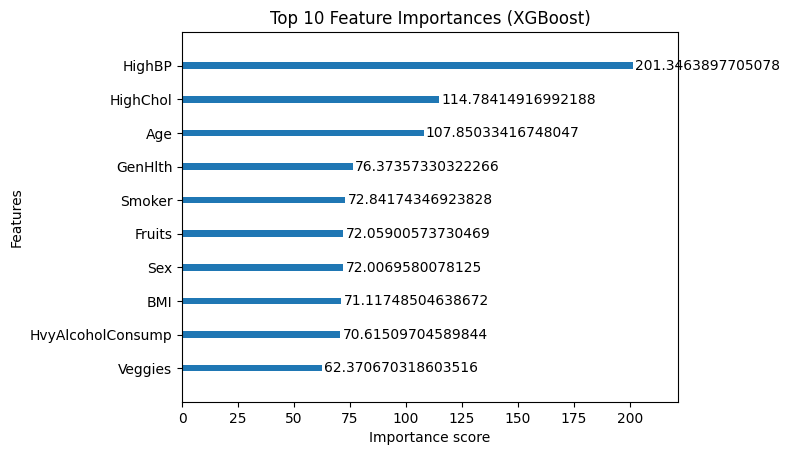

# 🩺 Diabetes Risk Prediction (Multiclass Classification)

- **Dataset**: `diabetes_012_health_indicators_BRFSS2015.csv`
- **Target**:
  - `0`: No Diabetes
  - `1`: Prediabetes
  - `2`: Diabetes
- **Challenge**: Severe imbalance — class 1 (Prediabetes) under 2%
- **Approach**:
  - Full EDA (univariate, bivariate, correlation heatmap)
  - SMOTE to oversample minority classes
  - Models: Logistic Regression, Random Forest, XGBoost
- **Best Model**: XGBoost with highest accuracy and class-wise F1 scores

  ## 📊 Key Visuals

### 🎯 Target Class Distribution
- Highlights class imbalance: Class 1 (Prediabetes) is under 2%

### 🌟 Feature Importance (XGBoost)
- Identifies top predictors across all 3 classes

### 🧩 Confusion Matrix
- Shows how well the model predicts each class

- **Insights**:
  - HighBP, HighChol, Age, and GenHlth are top drivers
  - Prediabetes remains difficult to predict even after resampling
